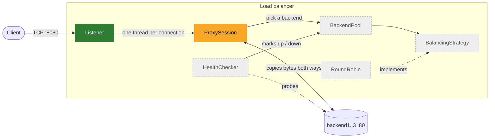

# L4 Load Balancer from Scratch

A TCP (layer 4) load balancer and reverse proxy written in C++20 from scratch, built as a learning project to understand and demonstrate core distributed-systems concepts: load distribution, failure detection and failover.

## Current status

**Session 2 of 7 complete.** The balancer already proxies TCP traffic, but only to one fixed backend and one connection at a time.

What works today:

- A Docker Compose environment with a build container (`lb`) and three demo backends (`backend1..3`, running [`traefik/whoami`](https://github.com/traefik/whoami)).
- A TCP **Listener** on `0.0.0.0:8080`.
- Forwarding to a single backend (`backend1:80`): for each client the balancer resolves the backend with `getaddrinfo`, connects, and relays bytes in both directions with `poll()`, propagating half-closes (see [ADR 0002](docs/adr/0002-copia-bidireccional-poll.md)).
- If the backend is down, the client connection is closed and the balancer keeps accepting; it recovers on its own when the backend comes back.
- Logs for each accepted connection, the backend connection (local ephemeral port and remote address) and the session close (bytes per direction and reason).

What is missing:

- Concurrency: connections are served one at a time, so a slow client blocks everyone else.
- The relay logic lives in free functions in `main.cpp`; the `ProxySession` component and RAII socket wrappers come in session 3.
- The backend pool, the balancing strategy, health checks and failover (see [Roadmap](#roadmap)).

## Architecture

Planned components. Green: implemented; amber: partially implemented; grey: planned.



| Component | Responsibility | Status |
|---|---|---|
| Listener | Binds the port and accepts client connections | ✅ Implemented (minimal) |
| ProxySession | Opens a connection to a backend and relays bytes in both directions | 🟡 Partial: works for one fixed backend, as free functions, one connection at a time |
| BackendPool | Holds the backends and their health state | Planned |
| BalancingStrategy / RoundRobin | Chooses the next backend (Strategy pattern; round-robin first) | Planned |
| HealthChecker | Periodically probes backends and marks them up or down | Planned |

## Design decisions

- **Layer 4 instead of layer 7.** The balancer terminates the client's TCP connection, opens a second one to a backend and copies bytes between them without parsing HTTP. This keeps the focus on networking and distributed-systems behaviour (connection handling, failure detection, failover) instead of protocol parsing, and works for any TCP protocol.
- **C++20 with raw POSIX sockets, no networking libraries.** No Boost.Asio or similar in v1. The point is to see exactly what `socket`, `bind`, `listen`, `accept` and friends do, and to handle their errors explicitly.
- **One thread per connection with blocking sockets (v1).** It is the simplest concurrency model to read and reason about. It does not scale to many thousands of connections; an event-driven model (`epoll`) is a possible later step, not a goal for v1.
- **Bidirectional copy with `poll()`.** One function waits on both sockets at once, so the session never blocks on the wrong side, and an EOF on one side is forwarded with `shutdown(SHUT_WR)` instead of closing everything, so protocols that rely on half-close keep working.
- **Everything runs in Docker.** The host is Windows, while the code targets Linux sockets. A container with gcc and CMake gives a reproducible Linux toolchain, and Docker Compose provides a private network with real backends to balance across.

The reasoning behind each decision is recorded as an ADR in [`docs/adr/`](docs/adr/).

## Quickstart

Requirements: Docker with Docker Compose.

```powershell
docker compose up -d --build
docker compose exec lb bash
```

Inside the container:

```bash
cmake -S . -B build && cmake --build build && ./build/lb
```

From the host, in another terminal (use plain `curl` on Linux/macOS and `/dev/null` instead of `NUL`):

```powershell
# whoami answers through the balancer: look for "Hostname: backend1"
curl.exe http://localhost:8080

# a 10 MB download must arrive complete
curl.exe "http://localhost:8080/data?size=10&unit=MB" -o NUL

# backend down: curl fails and the balancer keeps running
docker compose stop backend1
curl.exe http://localhost:8080

# backend back: works again without restarting the balancer
docker compose start backend1
curl.exe http://localhost:8080
```

The balancer logs every session, for example:

```
Conexión aceptada desde 172.19.0.1:51448
Backend conectado: 172.19.0.5:42856 -> 172.19.0.3:80
Sesión cerrada: cliente->backend 78 B, backend->cliente 281 B; motivo: ambos lados cerraron (EOF)
```

The client IP is the Docker gateway, not the host's address, because Docker NATs published ports.

> **Note (Docker Desktop on Windows):** while `backend1` is stopped, curl takes about 4 seconds to fail. The delay comes from DNS, not from the balancer: Docker's embedded DNS forwards the unknown name to the host resolver, which is slow to give up on single-label names. The balancer closes the client as soon as `getaddrinfo` returns the error.

## Repository structure

```
.
├── CLAUDE.md            # Architecture decisions and working rules (see "How this was built")
├── CMakeLists.txt       # C++20 build, -Wall -Wextra -Wpedantic
├── Dockerfile           # gcc:14 + cmake toolchain image
├── docker-compose.yml   # lb container + backend1..3 (traefik/whoami)
├── docs/
│   ├── adr/             # Architecture Decision Records
│   └── learning-log.md  # What I learned in each milestone (written by me, not AI-generated)
├── LICENSE
├── README.md
└── src/
    └── main.cpp         # Listener + forwarding to a single backend
```

## Roadmap

- [x] **Session 1** – Docker environment and minimal TCP listener
- [x] **Session 2** – Forward traffic to a single backend
- [ ] **Session 3** – Concurrency (thread per connection) and RAII wrappers for sockets
- [ ] **Session 4** – Backend pool and round-robin balancing
- [ ] **Session 5** – Health checks
- [ ] **Session 6** – Failover
- [ ] **Session 7** – Documentation

## How this was built

This project is developed with AI assistance using [Claude Code](https://claude.com/claude-code). The architecture decisions and working rules are written down in [`CLAUDE.md`](CLAUDE.md), which the assistant follows in every session; I define the scope of each session and review the resulting code and decisions. My personal record of each milestone is kept in the [learning log](docs/learning-log.md).

## License

[MIT](LICENSE) © 2026 Argi
