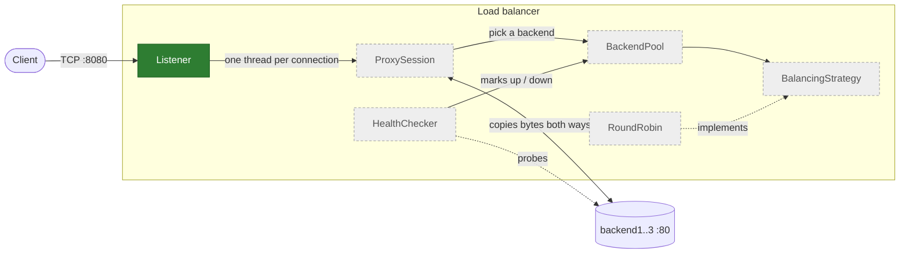

# L4 Load Balancer from Scratch

A TCP (layer 4) load balancer and reverse proxy written in C++20 from scratch, built as a learning project to understand and demonstrate core distributed-systems concepts: load distribution, failure detection and failover.

## Current status

**Session 1 of 7 complete.** This is an early-stage project; most of the load balancer does not exist yet.

What works today:

- A Docker Compose environment with a build container (`lb`) and three demo backends (`backend1..3`, running [`traefik/whoami`](https://github.com/traefik/whoami)).
- A minimal TCP **Listener** on `0.0.0.0:8080` that accepts connections, logs the client address and closes them immediately.

What is missing:

- Forwarding traffic to backends: the listener does not proxy anything yet, so clients get an empty reply.
- Concurrency, the backend pool, the balancing strategy, health checks and failover (see [Roadmap](#roadmap)).

## Architecture

Planned components. Only the highlighted one is implemented.



| Component | Responsibility | Status |
|---|---|---|
| Listener | Binds the port and accepts client connections | ✅ Implemented (minimal) |
| ProxySession | Opens a connection to a backend and relays bytes in both directions | Planned |
| BackendPool | Holds the backends and their health state | Planned |
| BalancingStrategy / RoundRobin | Chooses the next backend (Strategy pattern; round-robin first) | Planned |
| HealthChecker | Periodically probes backends and marks them up or down | Planned |

## Design decisions

- **Layer 4 instead of layer 7.** The balancer terminates the client's TCP connection, opens a second one to a backend and copies bytes between them without parsing HTTP. This keeps the focus on networking and distributed-systems behaviour (connection handling, failure detection, failover) instead of protocol parsing, and works for any TCP protocol.
- **C++20 with raw POSIX sockets, no networking libraries.** No Boost.Asio or similar in v1. The point is to see exactly what `socket`, `bind`, `listen`, `accept` and friends do, and to handle their errors explicitly.
- **One thread per connection with blocking sockets (v1).** It is the simplest concurrency model to read and reason about. It does not scale to many thousands of connections; an event-driven model (`epoll`) is a possible later step, not a goal for v1.
- **Everything runs in Docker.** The host is Windows, while the code targets Linux sockets. A container with gcc and CMake gives a reproducible Linux toolchain, and Docker Compose provides a private network with real backends to balance across.

## Quickstart

Requirements: Docker with Docker Compose.

```powershell
docker compose up -d --build
docker compose exec lb bash
```

Inside the container:

```bash
cmake -S . -B build && cmake --build build && ./build/lb
```

From the host, in another terminal:

```powershell
curl.exe http://localhost:8080   # plain `curl` on Linux/macOS
```

Expected result: the load balancer prints one line per connection, for example `Conexión desde 172.19.0.1:43558`, and curl reports `Empty reply from server` because the connection is closed without forwarding (yet). The IP is the Docker gateway, not the host's address, because Docker NATs published ports.

## Repository structure

```
.
├── CLAUDE.md            # Architecture decisions and working rules (see "How this was built")
├── CMakeLists.txt       # C++20 build, -Wall -Wextra -Wpedantic
├── Dockerfile           # gcc:14 + cmake toolchain image
├── docker-compose.yml   # lb container + backend1..3 (traefik/whoami)
├── docs/
│   └── learning-log.md  # What I learned in each milestone (written by me, not AI-generated)
├── LICENSE
├── README.md
└── src/
    └── main.cpp         # Minimal TCP listener
```

## Roadmap

- [x] **Session 1** – Docker environment and minimal TCP listener
- [ ] **Session 2** – Forward traffic to a single backend
- [ ] **Session 3** – Concurrency (thread per connection) and RAII wrappers for sockets
- [ ] **Session 4** – Backend pool and round-robin balancing
- [ ] **Session 5** – Health checks
- [ ] **Session 6** – Failover
- [ ] **Session 7** – Documentation

## How this was built

This project is developed with AI assistance using [Claude Code](https://claude.com/claude-code). The architecture decisions and working rules are written down in [`CLAUDE.md`](CLAUDE.md), which the assistant follows in every session; I define the scope of each session and review the resulting code and decisions. My personal record of each milestone is kept in the [learning log](docs/learning-log.md).

## License

[MIT](LICENSE) © 2026 Argi
